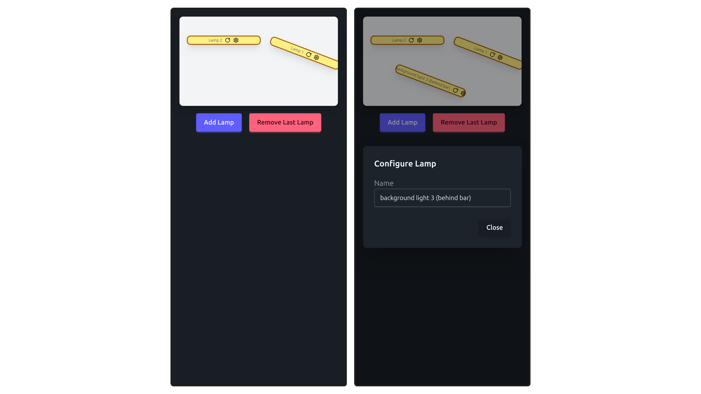

# Lamp Administration Prototype

uses `Vue3` typescript composition API, `Tailwind` + `Daisy.UI`. Fairly standard setup, everything interesting in `src/`.

## Features

App is live via `Netlify` **[here](https://lamp-ui.netlify.app/)**.

- place lamps in the room
- delete lamps
- rotate lamps
- configure lamps (POC, currently only name can be adjusted)
- manage data with clean types; easily extendable and able to communicate via some API with JSON

## Running it

(have `npm` installed)

```
npm i
npm run dev
```
